# Fluxograma de Engenharia de Dados: Mineração de Gastos Públicos

Este documento detalha a arquitetura do pipeline de ETL desenvolvido para processar e consolidar as despesas do Cartão Corporativo Federal (2016-2021).

## Arquitetura do Processo

```mermaid
graph LR
    %% --- ESTILOS VISUAIS (Bordas 4px) ---
    classDef process fill:#e1f5fe,stroke:#01579b,stroke-width:4px,rx:10,ry:10,color:#000;
    classDef storage fill:#fff3e0,stroke:#ef6c00,stroke-width:4px,rx:5,ry:5,color:#000;
    classDef config fill:#f3e5f5,stroke:#7b1fa2,stroke-width:4px,rx:5,ry:5,color:#000;
    classDef start fill:#000,stroke:#000,stroke-width:1px,color:#fff;
    
    %% Estilo da Fase 2 (Futuro)
    classDef phase2 fill:#fff,stroke:#d32f2f,stroke-width:4px,stroke-dasharray: 5 5,rx:5,ry:5,color:#d32f2f;

    %% --- FLUXO PRINCIPAL ---
    
    Start(("INÍCIO")):::start --> A1

    %% 1. Configuração
    A1["Configuração do Ambiente<br/>(Hadoop/Winutils + Libs)"]:::config
    A1 --> B1

    %% 2. Pré-Processamento
    B1["Conversão de Formatos<br/>.ODS para .XLSX"]:::process
    B1 --> C1

    %% 3. Ingestão (Spark)
    C1["Ingestão Inteligente<br/>(Detecção de Abas)"]:::process
    C1 --> D1

    %% 4. Transformação
    D1["Limpeza Nativa<br/>(Spark SQL / Regex)"]:::process
    D1 --> E1

    %% 5. Armazenamento Intermediário
    E1[("Parquet<br/>(Particionado)")]:::storage
    E1 --> F1

    %% 6. Consolidação
    F1["Consolidação Blindada<br/>(Unificação + Filtro)"]:::process
    F1 --> G1

    %% 7. Saída Final
    G1[("DATA LAKE<br/>(Consolidado)")]:::storage
    
    %% 8. Transição para Fase 2
    G1 --> P2["PRÓXIMA ETAPA: FASE 2<br/>Machine Learning (K-Means)<br/>& Detecção de Outliers"]:::phase2

    %% --- CONEXÕES DETALHADAS ---
    linkStyle 0,1,2,3,4,5,6,7 stroke:#333,stroke-width:1px;
```

---
**Legenda:**
* 🟣 **Roxo:** Configuração de Infraestrutura.
* 🔵 **Azul:** Processamento de Dados.
* 🟠 **Laranja:** Armazenamento (Data Lake).
* 🔴 **Tracejado:** Próximos Passos (Inteligência Artificial).
